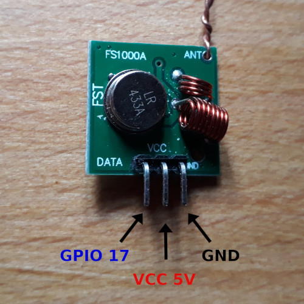

rfoutlet
========

Outlet control for Raspberry PI 2/3. The transmitter and receiver logic has
been ported from the great [rc-switch](https://github.com/sui77/rc-switch) C++
project to golang.

TODO

Screenshot                           | Raspberry PI Setup
:-----------------------------------:|:--------------------------------------:
 | 

Contents
--------

- [Prerequisites](#prerequisites)
- [Installation](#installation)
- [Commands](#commands)
- [Raspberry PI Setup](#raspberry-pi-setup)
- [Outlets](#outlets)
- [Development / Testing](#development-testing)
- [Todo](#todo)
- [License](#license)
- [Resources](#resources)

Prerequisites
-------------

See the [Raspberry PI Setup](#raspberry-pi-setup) section for setup of hardware
and required software.

### Hardware

- Raspberry PI 2 or 3
- Remote controlled outlets (see [Outlets](#outlets) section for suggestions)
- Receiver/Transmitter (e.g.
  [this](https://www.amazon.com/SMAKN%C2%AE-433Mhz-Transmitter-Receiver-Arduino/dp/B00M2CUALS/ref=sr_1_3?s=electronics&ie=UTF8&qid=1541529103&sr=1-3&keywords=433mhz+receiver+transmitter))
- SD Card
- Power supply
- Wiring
- Breadboard (optional)

### Software

- I use Arch Linux on the Raspberry PI, but Raspbian should also work
- `node` and `yarn` executables (tested with `node v10.11.0+`)
- golang (tested with `go v1.11+`)
- `make`

Older software versions may also work, but I did not test that.

Installation
------------

Obtain the source, build and install it as follows:

```sh
go get -u github.com/martinohmann/rfoutlet
cd $GOPATH/src/github.com/martinohmann/rfoutlet
make all
make install
```

You will find three new binaries below `$GOPATH/bin`: `rfoutlet`, `rfsniff` and
`rftransmit`.

If you only want to use the gpio transmitter and receiver for your own project,
just `go get` the project and check out the code in
[cmd/rfsniff/main.go](cmd/rfsniff/main.go) and
[cmd/rftransmit/main.go](cmd/rftransmit/main.go) for example usage.

```sh
go get -u github.com/martinohmann/rfoutlet
```

Commands
--------

Note: all commands requires `sudo` in order to access `/dev/gpiomem`.

### `rfoutlet` command

This command starts a server which listens on `0.0.0.0:3333` by default.

By default it
looks for its configuration file at `/etc/rfoutlet/config.yml`. Check
[dist/config.yml](dist/config.yml) for an example config file with all
available config values. Use the `rfsniff` command for reading the on/off
codes, protocol and pulse lengths for your outlets to put into the
configuration file.

Start the server:

```sh
sudo rfoutlet -listen-address 0.0.0.0:3333 -config /etc/rfoutlet/config.yml -gpio-pin 17
```

By default rfoutlet uses gpio pin 17 (physical 11 / wiringPi 0) for
transmission of the rf codes. A different pin can be use by providing the
`-gpio-pin` flag. Check out the [Raspberry Pi pinouts](https://pinout.xyz/) for
reference.

### `rfsniff` command

This command listens on a gpio pin and tries to sniff codes sent out by 433 Mhz
remote controls. It will print the received code, protocol, pulse length and
bit length to stdout when you press the on/off buttons on your remote.

```sh
sudo rfsniff -gpio-pin 27
```

### `rftransmit` command

This command sends out remote control codes on the provided gpio pin. It can be used
for testing or you can wrap it for use in another application.

Example:

```sh
sudo rftransmit -gpio-pin 17 -protocol 1 -pulse-length 189 123
```

Raspberry PI Setup
------------------

### Install required software

On Arch Linux the following commands should be sufficient to install the
required software:

```sh
sudo pacman -Sy go nodejs npm make
sudo npm -g install yarn
```

On Raspbian the following should do (untested):

```sh
wget https://storage.googleapis.com/golang/go1.11.1.linux-armv6l.tar.gz
sudo tar -C /usr/local -xvf go1.11.1.linux-armv6l.tar.gz
rm go1.11.1.linux-armv6l.tar.gz
curl -sL https://deb.nodesource.com/setup_10.x | sudo -E bash -
sudo apt-get install -y build-essential nodejs
sudo npm -g install yarn
```

Set up `$GOPATH` afterwards:

```sh
cat >> ~/.bashrc << 'EOF'
export GOPATH=$HOME/go
export PATH=/usr/local/go/bin:$PATH:$GOPATH/bin
EOF
source ~/.bashrc
```

### Wiring transmitter and receiver

The wiring of transmitter and receiver is straight forward and can be best
described using images:

Transmitter                            | Receiver
:-------------------------------------:|:-------------------------------:
 | 

To increase the range of the transmitter I use a 25cm wire as antenna. I just
twisted it with a pair of pliers to hold it in place, soldering is optional.
This covers my whole appartment (105sqm). YMMV.

Outlets
-------

I achieved good results with the following remote controlled outlets:

- [Etekcity Remote Control Outlet Wireless Light Switch](https://www.amazon.com/Etekcity-Household-Appliances-Unlimited-Connections/dp/B00DQELHBS/ref=sr_1_4?ie=UTF8&qid=1541529214&sr=8-4&keywords=etekcity+remote+control+outlet+wireless)
- [Brennenstuhl RCS 1000 N Comfort](https://www.amazon.de/gp/product/B001AX8QUM/ref=oh_aui_detailpage_o00_s00?ie=UTF8&psc=1)

Please let me know about others that work well too, so I can extend the list here.

Development / Testing
---------------------

rfoutlet is meant to run on a Raspberry PI 2/3 to work properly. However, for
development purposes you can also run it on your local machine. In this case the
transmission of the rf codes is stubbed with a NullTransmitter.

Run `make` without arguments to see available commands for building and testing.

Todo
----

- [x] implement code transmitter (see [`cmd/rftransmit`](cmd/rftransmit))
- [x] implement code receiver (see [`cmd/rfsniff`](cmd/rfsniff))
- [x] make transmitter/receiver code available as library below `pkg/`
- [ ] persist outlet state across server restarts
- [ ] use receiver to detect outlet state changes (e.g. via remote control)?
- [ ] time switch: switch outlets on/off using user defined rules (e.g. fixed
  time or relative)
- [ ] use web sockets for communication to be able to push outlet state changes
  to multiple clients

License
-------

The source code of this is released under the MIT License. See the bundled LICENSE
file for details.

[](http://creativecommons.org/licenses/by-nc/4.0/)

The images belonging to this project are licensed under a [Creative Commons
Attribution-NonCommercial 4.0 International
License](http://creativecommons.org/licenses/by-nc/4.0/).

Resources
---------

- [Raspberry Pi pinouts](https://pinout.xyz/)
- [Wireless Power Outlets](https://timleland.com/wireless-power-outlets/)
- [ninjablocks 433Utils](https://github.com/ninjablocks/433Utils)
- [rc-switch](https://github.com/sui77/rc-switch)
- [WiringPi](https://projects.drogon.net/raspberry-pi/wiringpi/download-and-install/)
